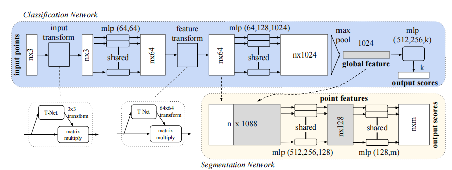
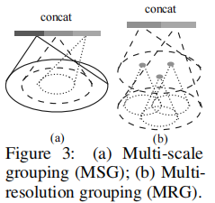
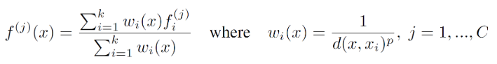
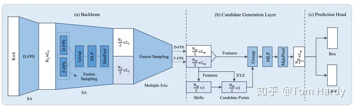

# PointCloud
PointCloud knowledge

## pointnet

3D点云的挑战:
1. 以无序点云作为输入，因此模型需要具备排序不变性
2. 点云的旋转，平移不应该改变点云的类别，因此模型需要具备几何变换不变性

解决办法：
1. 当一个(N imes D) 在 N的维度上随意的打乱之后，其表述的应该是同一个物体。为了实现这一点。一个简单的方法是使用对称函数，如SUM和MAX等函数：
因此我们可以用max函数设计一个很简单的点云网络，如下：
   

    因此我们构造的网络也应是一个具有对称函数特特性的网络。但是这样的网络有一个问题，就是每个点损失的特征太多了，输出的全局特征仅仅继承了三个坐标轴上最大的那个特征，此时我们发现，当我们将点云的每个点先映射到一个冗余的高维空间后（例如1024维），再去进行max的对称函数操作，损失的特征就没那么多了。由此，就可以设计出这PointNet的雏形，称之为PointNet(vanilla)：
h：高维映射
g：对称函数
r：MLP
2. 几何变换不变性
对于一个点云，进行平移和旋转之后应该表示的仍然是同一物体。
对于普通的PointNet(vanilla)，如果先后输入同一个但是经过不同旋转角度的物体，它可能不能很好地将其识别出来。在论文中的方法是新引入了一个T-Net网络去学习点云的旋转，将物体校准，剩下来的PointNet(vanilla)只需要对校准后的物体进行分类或者分割即可。
   对于三维点的旋转只需乘以一个 3 × 3的旋转矩阵，即可将其矫正；同样的将点云映射到K维的冗余空间后，也是学习一个k×k的旋转矩阵，只不过因为旋转矩阵具有正交性，因此这次校对需要引入一个正则化惩罚项，希望其尽可能接近于一个正交矩阵。
   

代码实现：
1. MLP
```python
self.conv1 = torch.nn.Conv1d(3, 64, 1)
self.conv2 = torch.nn.Conv1d(64, 128, 1)
self.conv3 = torch.nn.Conv1d(128, 1024, 1)
```
2. Tnet
```python
    def forward(self, x):
        batchsize = x.size()[0]
        x = F.relu(self.bn1(self.conv1(x)))
        x = F.relu(self.bn2(self.conv2(x)))
        x = F.relu(self.bn3(self.conv3(x)))
        x = torch.max(x, 2, keepdim=True)[0]
        x = x.view(-1, 1024)

        x = F.relu(self.bn4(self.fc1(x)))
        x = F.relu(self.bn5(self.fc2(x)))
        x = self.fc3(x)

        iden = Variable(torch.from_numpy(np.eye(self.k).flatten().astype(np.float32))).view(1,self.k*self.k).repeat(batchsize,1)
        if x.is_cuda:
            iden = iden.cuda()
        x = x + iden
        x = x.view(-1, self.k, self.k)
        return x
```


## pointnet++(点云版Unet)

主要特点：
1. 使用FPS 进行采样
2. 模仿CNN进行局部特征的提取，具体如下：
   + 选取N个中心点
   + 对中心点选取K个紧邻点
   + 每K个近邻点进行pointnet卷积运算得到特征，此时网络的输出为（N,K,d+c)
3. 点云不均匀的时候，在密集区域学习出来的特征可能不适合稀疏区域(个人感觉是模仿感受野不断扩大)
   
   + MSG:对方法MSG而言，是对不同半径的子区域进行特征提取后进行特征堆叠，特征提取过程还是采用了PointNet
   + MGR:作者是考虑到上述的MSG方法计算量太大，提出来的备选方案MRG。MRG用两个Pointnet对连续的两层分别做特征提取与聚合，然后再进行特征拼接。
4. 分割跳跃层连接：提出了一种利用基于距离插值的分层特征传播（Feature Propagation）策略。
   + 基于k近邻的反向距离加权平均的插值方式，实现了丢失点（待插值点）特征的求解。
   
   + 将插值特征与先前阶段的特征（两者具有相同数量的特征点）通过skip-link的结构连接后进行特征堆叠。 
## VoxelNet

1. 体素分割，沿着Z,Y,X轴分出D * H * W 个体素
2. 对每个体素进行特征提取，类似pointnet，先逐点进行特征提取，然后最大池化，进行拼接。
3. 得到每个体素的特征后，对应一个通道为C的一维特征向量，对于整个点云来说得到C * D * H * W的4维特征向量，然后进行3D卷积提取特征
4. 对步骤3得到的特征图进行RPN操作。
## SECOND

[pytorch代码](https://github.com/traveller59/second.pytorch)

## PointPillars

1. 划分柱体，沿着x,y轴划分网格，落入网格的点云即得到一个柱体，
2. 每个柱体采样N（多去少补）个点，每个点为9个维度（x,y,z,r,xc,yc,zc,xp,yp),分别是点坐标，反射强度，对应柱体的几何中心，点与几何中心的相对位置。
3. 划分柱体后的张量为（D,P,N)， D=9，P=柱体的数目， N=点云的数目。进行pointnet特征学习，张量变为（C，P，N）。
4. 按照pillar所在维度的N个点云进行最大池化操作，得到（C，P)维度张量，将P扩展为（H,W)即得到(C,H,W)的伪特征图。
5. 然后使用SSD的检测头进行输出。
6. 损失函数，每个3Dbox用7维向量（x,y,z,w,h,l,θ)表示中心坐标，尺寸数据，方向角。回归任务学习这7个参数的偏移量。

## 3DSSD

1. 使用F-FPS在采样过程中获取更多的前景点
2. 融合采样，F-FPS过程虽然使得大部分实例的前景点被保存了，但是因为采样点总数的限制，会造成大部分背景点被丢弃了。
   作者说，这其实虽然有利于回归任务，但是不利于分类任务。因为在SA模块中，有一步叫做特征聚合。也就是一个点和它周围一定范围内的点进行局部特征的提取。但是如果背景点过少了，那会造成某个点周围的背景点数量不足，那么感受野也会受限的，因此在分类任务中效果并不好。 
   因此，为了使得模型的分类任务也能有个不错的效果，自然需要足够多的背景点。于是，作者在SA层中提出了一种结合D-FPS和F-FPS方法的融合采样方法，其中两种采样方法各采一半的点。
3. 使用Anchor_free的方法进行预测输出
   + 每个候选点到其对应的实例Gt bbox中心点的距离
   + 每个候选点对应的实例Gt bbox的尺度信息
   + 每个候选点对应的实例Gt bbox的转角信息，引入了bin+res的形式进行回归