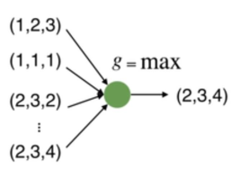
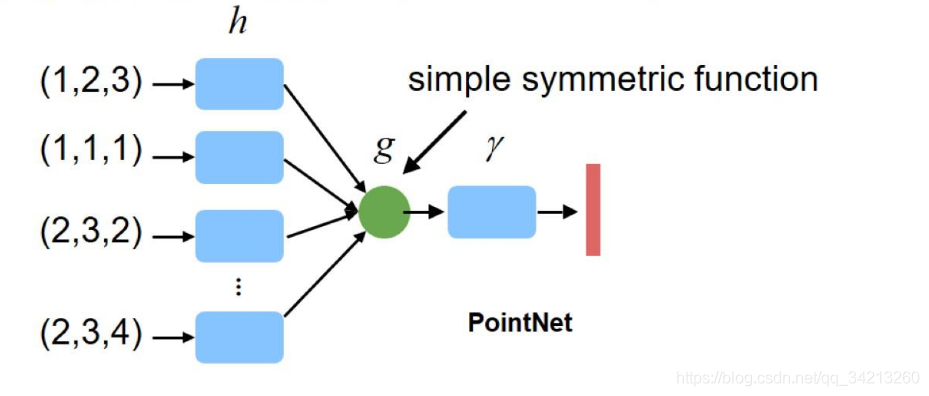
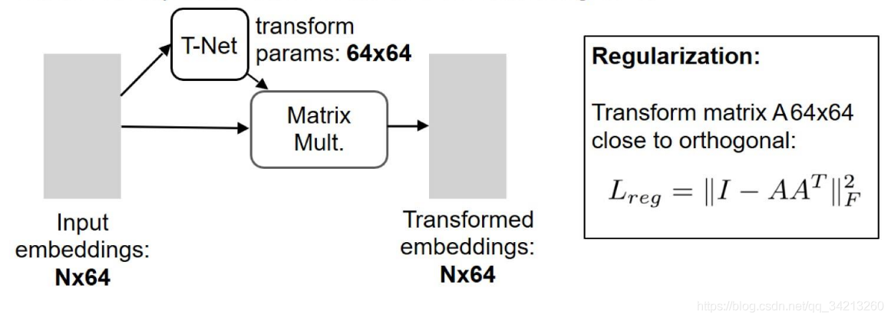
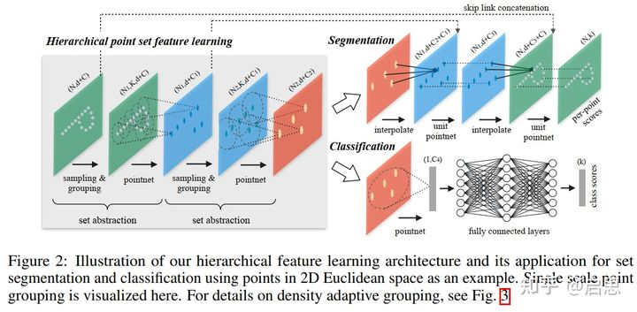
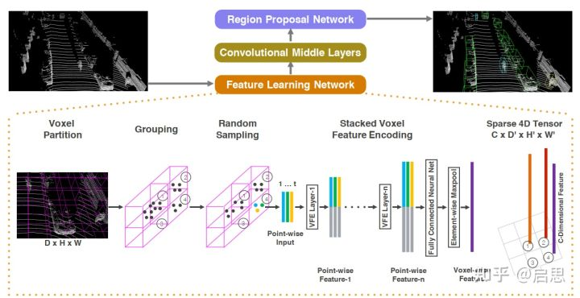
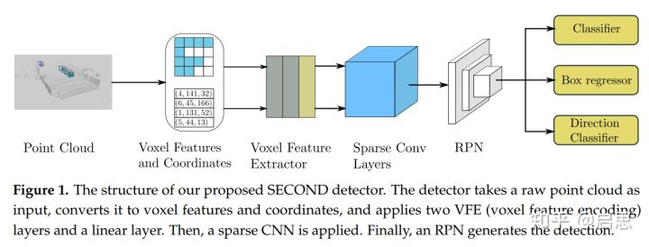
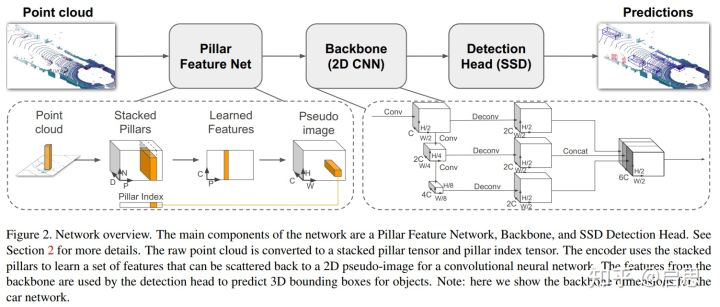

# PointCloud
PointCloud knowledge

## pointnet
3D点云的挑战:
1. 以无序点云作为输入，因此模型需要具备排序不变性
2. 点云的旋转，平移不应该改变点云的类别，因此模型需要具备几何变换不变性

解决办法：
1. 当一个(N imes D) 在 N的维度上随意的打乱之后，其表述的应该是同一个物体。为了实现这一点。一个简单的方法是使用对称函数，如SUM和MAX等函数：
因此我们可以用max函数设计一个很简单的点云网络，如下：
   

    因此我们构造的网络也应是一个具有对称函数特特性的网络。但是这样的网络有一个问题，就是每个点损失的特征太多了，输出的全局特征仅仅继承了三个坐标轴上最大的那个特征，此时我们发现，当我们将点云的每个点先映射到一个冗余的高维空间后（例如1024维），再去进行max的对称函数操作，损失的特征就没那么多了。由此，就可以设计出这PointNet的雏形，称之为PointNet(vanilla)：
h：高维映射
g：对称函数
r：MLP
2. 几何变换不变性
对于一个点云，进行平移和旋转之后应该表示的仍然是同一物体。
对于普通的PointNet(vanilla)，如果先后输入同一个但是经过不同旋转角度的物体，它可能不能很好地将其识别出来。在论文中的方法是新引入了一个T-Net网络去学习点云的旋转，将物体校准，剩下来的PointNet(vanilla)只需要对校准后的物体进行分类或者分割即可。
   对于三维点的旋转只需乘以一个 3 × 3的旋转矩阵，即可将其矫正；同样的将点云映射到K维的冗余空间后，也是学习一个k×k的旋转矩阵，只不过因为旋转矩阵具有正交性，因此这次校对需要引入一个正则化惩罚项，希望其尽可能接近于一个正交矩阵。
   

## pointnet++(点云版Unet)

## VoxelNet

## SECOND

[pytorch代码](https://github.com/traveller59/second.pytorch)

## PointPillars

## 3DSSD

